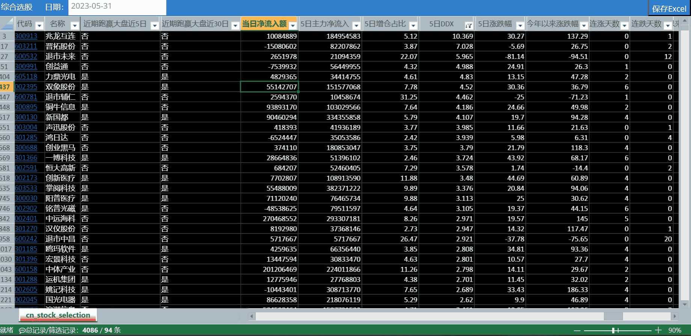
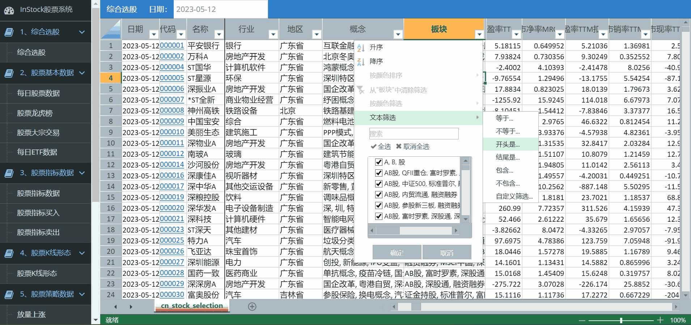
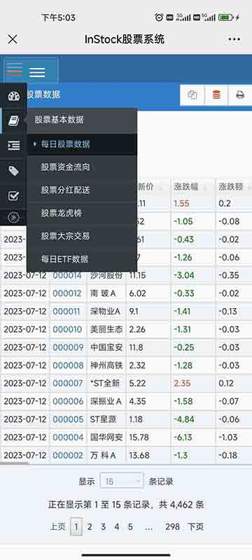
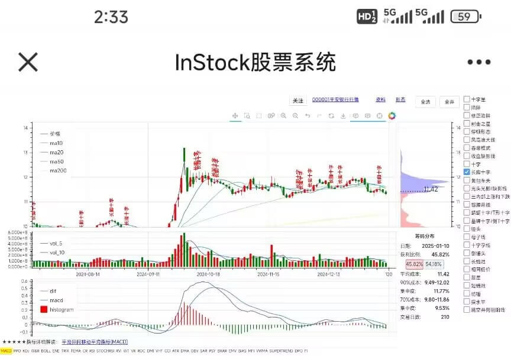
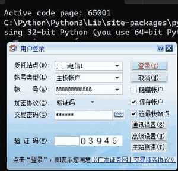

**InStock股票系统 - Fork版本**

> **📌 项目来源**: 本项目 Fork 自 [myhhub/stock](https://github.com/myhhub/stock/blob/master/README.md)，在原项目基础上进行了重要改进和优化。

## 🔄 主要修改与改进

### 1. 🗄️ 增加数据导入工具（可单独执行）
- 新增 **MySQL** 和 **ClickHouse** 数据导入支持
- 提供完整的历史数据获取和处理工具链
- 详细文档参见：[history_data/README.md](history_data/README.md)
- 支持 baostock 数据源，比 akshare 和 tushare 更稳定
- 支持分片并发执行，大幅提升数据获取效率

### 2. 🎨 界面组件开源化  
- 使用 **Luckysheet** 开源方案替代商用组件
- 不再依赖葡萄城等付费前端组件
- 降低使用成本，提高项目可维护性

### 3. ⚡ 性能优化与架构升级
- **减少 API 调用**：每天只爬取增量数据，其余采用本地数据
- **ClickHouse 存储重构**：重写存储相关逻辑
- 大幅提升查询性能和数据处理效率
- 支持海量历史数据的高效存储与分析
### 4. 🌐 代理支持优化
- **智能代理池设计**：支持多种代理服务商的接口
- **缓存机制**：针对短效代理（1-5分钟）进行智能缓存，避免频繁获取
- **配置灵活**：默认不走代理，可根据需要配置不同品牌的代理服务
- **数据源说明**：每日数据获取基于封装的 akshare 从东方财富接口获取，建议配置代理避免IP限制
- **代理配置**：根据购买的代理品牌修改 `proxy_pool.py` 即可，当前示例为青果按量付费短效代理

### 5. AI agent引入（开发中）
- 基于每日的策略数据，通过AI进行分析挖掘
- AI自动发掘策略
---

## 📖 原项目介绍

InStock股票系统，抓取每日股票、ETF关键数据，计算股票技术指标、筹码分布，识别K线各种形态，综合选股，内置多种选股策略，支持选股验证回测，支持自动交易，支持批量时间，运行高效，支持PC、平板、手机移动设备显示，同时提供Docker镜像方便安装，是量化投资的好帮手。

The stock system,Capture key data on daily stocks and ETFs, calculate stock technical indicators, chip distribution, Position Cost Distribution(CYQ), identify various K-line forms, comprehensive stock selection, built-in multiple stock selection strategies, support stock selection verification and backtesting, support automatic trading, and support batch time , runs efficiently, supports display on PCs, tablets, and mobile phones, and provides Docker images for easy installation, making it a good helper for quantitative investment.

Docker镜像：https://hub.docker.com/r/mayanghua/instock **镜像优化构建仅170M**。

# 功能介绍

##  一：综合选股
综合选股支持股票范围、基本面、技术面、消息面、人气指标、行情数据等方面共200多个信息栏目进行自由组合选股。选股条件分为以下大类：
```
1.股票范围
市场、 行业、地区、 概念、 风格、指数成份、 上市时间。
2.基本面
估值指标、每股指标、盈利能力、成长能力、资本结构与偿债能力、股本股东。
3.技术面
MACD金叉、KDJ金叉、放量突破、低位资金净流入、高位资金净流出、向上突破均线、均线多头排列、均线空头排列、连涨放量、下跌无量、一根大阳线、两根大阳线、旭日东升、强势多方、炮拨云见日、七仙女下凡(七连阴)、八仙过海(八连阳)、九阳神功(九连阳)、四串阳、天量法则、放量上攻、穿头破脚、倒转锤头、射击之星、黄昏之星、曙光初现、身怀六甲、乌云盖顶、早晨之星、窄幅整理。
4.消息面
公告大事、机构关注情况、机构持股家数、机构持股比例。
5.人气指标
股吧人气排名、人气排名变化、人气排名连涨、人气排名连跌、人气排名创新高、人气排名创新低、新晋粉丝占比、铁杆粉丝占比、7日关注排名、今日浏览排名。
6.行情数据
股价表现、成交情况、资金流向、行情统计、沪深股通。
```



##  二：股票每日数据

包括每日股票数据、股票资金流向、股票分红配送、股票龙虎榜、股票大宗交易、股票基本面数据、行业资金流向、概念资金流向、早盘抢筹数据、尾盘抢筹数据、涨停原因揭密、每日ETF数据。

抓取A股票每日数据，主要为一些关键数据，同时封装抓取方法，方便扩展系统获取个人关注的数据。



## 三：股票指标计算
基于talib、pandas 计算指标，计算高效准确。调整个别指标公式，确保结果和同花顺、通信达结果一致。
指标：

```
1、MACD 2、KDJ 3、BOLL 4、TRIX，TRMA 5、CR 6、SMA 7、RSI 
8、VR，MAVR 9、ROC 10、DMI，+DI，-DI，DX，ADX，ADXR 11、W&R 
12、CCI 13、TR、ATR 14、DMA、AMA 15、OBV 16、SAR 17、PSY 
18、BRAR 19、EMV 20、BIAS 21、TEMA  22、MFI 23、VWMA
24、PPO 25、WT 26、Supertrend  27、DPO  28、VHF  29、RVI
30、FI 31、ENE 32、STOCHRSI
```


## 四：判断买入卖出的股票

根据指标判定可能买入卖出的股票，具体筛选条件如下：


```
KDJ:
1、超买区：K值在80以上，D值在70以上，J值大于90时为超买。一般情况下，股价有可能下跌。投资者应谨慎行事，局外人不应再追涨，局内人应适时卖出。
2、超卖区：K值在20以下，D值在30以下为超卖区。一般情况下，股价有可能上涨，反弹的可能性增大。局内人不应轻易抛出股票，局外人可寻机入场。
RSI:
1、当六日指标上升到达80时，表示股市已有超买现象，如果一旦继续上升，超过90以上时，则表示已到严重超买的警戒区，股价已形成头部，极可能在短期内反转回转。
2、当六日强弱指标下降至20时，表示股市有超卖现象，如果一旦继续下降至10以下时则表示已到严重超卖区域，股价极可能有止跌回升的机会。
CCI:
1、当CCI＞﹢100时，表明股价已经进入非常态区间——超买区间，股价的异动现象应多加关注。
2、当CCI＜﹣100时，表明股价已经进入另一个非常态区间——超卖区间，投资者可以逢低吸纳股票。
CR:
1、跌穿a、b、c、d四条线，再由低点向上爬升160时，为短线获利的一个良机，应适当卖出股票。
2、CR跌至40以下时，是建仓良机。
WR:
1、当％R线达到20时，市场处于超买状况，走势可能即将见顶。
2、当％R线达到80时，市场处于超卖状况，股价走势随时可能见底。
VR:
1、获利区域160－450根据情况获利了结。
2、低价区域40－70可以买进。
```


## 五：K线形态识别

精准识别61种K线形态，支持用户自选形态识别。

识别形态:

```
1、两只乌鸦2、三只乌鸦3、三内部上涨和下跌4、三线打击5、三外部上涨和下跌6、南方三星7、三个白兵8、弃婴
9、大敌当前10、捉腰带线11、脱离12、收盘缺影线13、藏婴吞没14、反击线15、乌云压顶16、十字17、十字星
18、蜻蜓十字/T形十字19、吞噬模式20、十字暮星  21、暮星22、向上/下跳空并列阳线23、墓碑十字/倒T十字
24、锤头25、上吊线26、母子线27、十字孕线28、风高浪大线29、陷阱30、修正陷阱31、家鸽32、三胞胎乌鸦
33、颈内线34、倒锤头35、反冲形态36、由较长缺影线决定的反冲形态37、梯底38、长脚十字39、长蜡烛
40、光头光脚/缺影线 41、相同低价42、铺垫43、十字晨星44、晨星45、颈上线46、刺透形态47、黄包车夫
48、上升/下降三法49、分离线50、射击之星51、短蜡烛52、纺锤53、停顿形态54、条形三明治55、探水竿
56、跳空并列阴阳线57、插入58、三星59、奇特三河床60、向上跳空的两只乌鸦61、上升/下降跳空三法 
```
形态识别结果：
```
负：出现卖出信号
0：没有出现该形态
正：出现买入信号
```



## 六：筹码分布

筹码分布通过计算一定时间范围内股票的:最高价、最低价、成交数，输出对应价格成交数占整个流通盘比值的分布图形。计算高效准确，结果与东方财富等专业软件的一致，缺省计算210个交易日的成本，可以自行设定时间范围。


## 七：策略选股

内置放量上涨、停机坪、回踩年线、突破平台、放量跌停等多种选股策略，同时封装了策略模板，方便扩展实现自己的策略。


```
1、放量上涨
    1）当日比前一天上涨小于2%或收盘价小于开盘价。
    2）当日成交额不低于2亿。
    3）当日成交量/5日平均成交量>=2。
2、均线多头
    MA30向上
    1）30日前的30日均线<20日前的30日均线<10日前的30日均线<当日的30日均线。
    2）(当日的30日均线/30日前的30日均线)>1.2。
3、停机坪
    1）最近15日有涨幅大于9.5%，且必须是放量上涨。
    2）紧接的下个交易日必须高开，收盘价必须上涨，且与开盘价不能大于等于相差3%。
    3）接下2、3个交易日必须高开，收盘价必须上涨，且与开盘价不能大于等于相差3%，且每天涨跌幅在5%间。
4、回踩年线
    1）分2个时间段：前段=最近60交易日最高收盘价之前交易日(长度>0)，后段=最高价当日及后面的交易日。
    2）前段由年线(250日)以下向上突破。
    3）后段必须在年线以上运行，且后段最低价日与最高价日相差必须在10-50日间。
    4）回踩伴随缩量：最高价日交易量/后段最低价日交易量>2,后段最低价/最高价<0.8。
5、突破平台
    1）60日内某日收盘价>=60日均线>开盘价。
    2）且【1】放量上涨。
    3）且【1】间之前时间，任意一天收盘价与60日均线偏离在-5%~20%之间。
6、无大幅回撤
    1）当日收盘价比60日前的收盘价的涨幅小于0.6。
    2）最近60日，不能有单日跌幅超7%、高开低走7%、两日累计跌幅10%、两日高开低走累计10%。
7、海龟交易法则
    最后一个交易日收市价为指定区间内最高价。
    1）当日收盘价>=最近60日最高收盘价。
8、高而窄的旗形
    1）必须至少上市交易60日。
    2）当日收盘价/之前24~10日的最低价>=1.9。
    3）之前24~10日必须连续两天涨幅大于等于9.5%。
9、放量跌停。
    1）跌>9.5%。
    2）成交额不低于2亿。
    3）成交量至少是5日平均成交量的4倍。
10、低ATR成长
    1）必须至少上市交易250日。
    2）最近10个交易日的最高收盘价必须比最近10个交易日的最低收盘价高1.1倍。
11、股票基本面选股
    1）市盈率小于等于20，且大于0。
    2）市净率小于等于10。
    3）净资产收益率大于等于15。
```


## 八：选股验证


对指标、策略等选出的股票进行回测，验证策略的成功率，是否可用。


## 九：自动交易

支持自动交易，内置自动打新股的策略及示例策略，由于**涉及金钱**，规避可能存在风险，没有提供其他交易策略。

具有交易日志，以及支持为每个交易策略配置交易日志。

**特别提醒**：交易日10:00点会触发打新，不想打新的删除stagging.py或不要启动“交易服务”。



## 十：关注功能

支持股票关注，关注股票在各个模块(含有的)置顶、标红显示。

## 十一：支持批量


可以通过时间段、枚举时间、当前时间进行指标计算、策略选股及回测等。同时支持智能识别交易日，可以输入任意日期。

具体执行设置如下：
```
------整体作业，支持批量作业------
当前时间作业 python execute_daily_job.py
单个时间作业 python execute_daily_job.py 2022-03-01
枚举时间作业 python execute_daily_job.py 2022-01-01,2021-02-08,2022-03-12
区间时间作业 python execute_daily_job.py 2022-01-01 2022-03-01

------单功能作业，支持批量作业，回测数据自动填补到当前
基础数据实时作业 python basic_data_daily_job.py
基础数据非实时作业 python basic_data_other_daily_job.py
指标数据作业 python indicators_data_daily_job.py
K线形态作业 klinepattern_data_daily_job.py
策略数据作业 python strategy_data_daily_job.py
回测数据 python backtest_data_daily_job.py
```
## 十二：支持代理

支持多代理获取数据。由于很多网站对大量请求有防护机制，使用单一IP地址频繁访问可能导致被封禁或限制访问。代理IP能够帮助分散请求来源，避免单一IP被封锁，从而保证爬虫程序的稳定运行。

## 十三：存储采用数据库设计

数据存储采用数据库设计，能保存历史数据，以及对数据进行扩展分析、统计、挖掘。系统实现自动创建数据库、数据表，封装了批量更新、插入数据，方便业务扩展。


## 十四：展示采用web设计

采用web设计，可视化展示结果。对展示进行封装，添加新的业务表单，只需要配置视图字典就可自动出现业务可视化界面，方便业务功能扩展。

## 十五：运行高效


采用多线程、单例共享资源有效提高运算效率。1天数据的抓取、计算指标、形态识别、策略选股、回测等全部任务运行时间大概4分钟（普通笔记本），计算天数越多效率越高。


## 十六：方便调试

系统运行的重要日志记录在stock_execute_job.log(数据抓取、处理、分析)、stock_web.log(web服务)、stock_trade.log(交易服务)，方便调试发现问题。


# 安装说明

本系统支持Windows、Linux、MacOS，同时本系统创建了Docker镜像，按自己需要选择安装方式。

下面按分常规安装方式、docker镜像安装方式进行一一说明。

## 一：常规安装方式

建议windows下安装，方便操作及使用系统，同时安装也非常简单。

以下安装及运行以windows为例进行介绍。

### 1.安装python

项目开发使用python 3.11，建议最新版。

```
（1）在官网 https://www.python.org/downloads/ 下载安装包，一键安装即可，安装切记勾选自动设置环境变量。
（2）配置永久全局国内镜像库（因为有墙，无法正常安装库文件），执行如下dos命令：
python pip config --global set  global.index-url https://mirrors.aliyun.com/pypi/simple/
# 如果你只想为当前用户设置，你也可以去掉下面的"--global"选项
```
### 2.安装mysql

建议最新版。

```
在官网 https://dev.mysql.com/downloads/mysql/ 下载安装包，一键安装即可。
```
### 3.安装 TA-Lib 共享静态库和头文件

安装 TA-Lib C/C++ 共享静态库和头文件

```
https://ta-lib.org/install/ 下载最新 ta-lib 共享静态库和头文件，按照说明进行安装。
安装方式按官方建议，会更简单：
Windows Executable Installer
macOS Homebrew
Linux Debian packages
```

### 4.安装依赖库

依赖库都是目前最新版本。

a.安装依赖库：

```
#dos切换到本系统的根目录，执行下面命令：
python pip install -r requirements.txt
```
b.若想升级项目依赖库至最新版，可以通过下面方法：

先打开requirements.txt，然后修改文件中的“==”为“>=”，接着执行下面命令：

```
python pip install -r requirements.txt --upgrade
```

c.若扩展了本项目，可以通过下面方法生成项目依赖：

```
#使用pipreqs生成项目相关依赖的requirements.txt

python pip install pipreqs
# 安装pipreqs，若有安装可跳过

python  pipreqs --encoding utf-8 --force ./ 
# 本项目是utf-8编码
```


### 5.安装 Navicat（可选）

Navicat可以方便管理数据库，以及可以手工对数据进行查看、处理、分析、挖掘。

Navicat是一套可创建多个连接的数据库管理工具，用以方便管理 MySQL、Oracle、PostgreSQL、SQLite、SQL Server、MariaDB 和 MongoDB 等不同类型的数据库

```
（1）在官网 https://www.navicat.com.cn/download/navicat-premium 下载安装包，一键安装即可。

（2）然后下载破解补丁: https://pan.baidu.com/s/18XpTHrm9OiLEl3u6z_uxnw 提取码: 8888 ，破解即可。
```
### 6.配置数据库

一般可能会修改的信息是”数据库访问密码“。

修改database.py相关信息:

```
db_host = "localhost"  # 数据库服务主机
db_user = "root"  # 数据库访问用户
db_password = "root"  # 数据库访问密码
db_port = 3306  # 数据库服务端口
db_charset = "utf8mb4"  # 数据库字符集
```

### 7.配置代理

#### 7.1 代理必要性说明
由于每日数据获取使用封装的 akshare 从东方财富接口获取数据，频繁请求可能导致IP被限制。建议购买代理服务以确保数据获取稳定性。

#### 7.2 代理配置方式

**方式一：环境变量配置（推荐）**
```bash
# 青果代理示例
export qg_authKey="your_auth_key"
export qg_password="your_password"
```

**方式二：修改代理池文件**
根据购买的代理品牌，修改 `instock/core/proxy_pool.py` 中的代理获取逻辑。

#### 7.3 支持的代理类型
- **青果代理**：按量付费短效代理（1-5分钟），内置缓存机制
- **其他代理商**：可自行修改 `proxy_pool.py` 适配不同接口
- **静态代理**：编辑 `proxy.txt` 文件，格式为 `ip:port` 或 `username:password@ip:port`

#### 7.4 代理配置说明
```python
# 不使用代理（默认）
不设置任何环境变量或代理文件

# 使用青果代理
export qg_authKey="your_auth_key"
export qg_password="your_password"

# 使用静态代理文件
编辑 proxy.txt，添加代理列表：
127.0.0.1:7860
52.13.248.29:3128
abc:123456@35.178.104.4:80
```

**注意**：
- 代理配置修改后需要重启系统才能生效
- 青果代理支持智能缓存，避免频繁获取短效代理
- 以上示例代理均为无效代理，请使用真实购买的代理

### 8.安装自动交易（可选）

```
1.安装交易软件
    1.1 通用同花顺客户端券商的客户
        通用同花顺客户端:
        https://activity.ths123.com/acmake/cache/1361.html
    1.2 专用同花顺客户端券商的客户
        自行去券商官网找同花顺专用版
        例如：广发的下载核新独立委托端(同花顺版):
        http://www.gf.com.cn/softdownload/index?tab=1
2.安装tesseract(自动识别验证码)
    第一种方法.下载编译好的
        在下面链接页，根据操作系统选择相应版本
        https://digi.bib.uni-mannheim.de/tesseract/
    第二种方法.用源码编译
        下载源码：https://github.com/tesseract-ocr/tesseract
    注意：
        安装完要将安装路径设置到PATH环境变量里。
        下面提供dos命令设置，以管理员身份运行cmd，输入:
        setx /m PATH "%PATH%;C:\Program Files\Tesseract-OCR"
3.设置交易配置   
    3.1.修改trade_client.json
        "user": "888888888888",               #交易账号
        "password": "888888",                 #交易密码
        "exe_path": "C:/gfzqrzrq/xiadan.exe"  #交易软件路径
    3.2.修改trade_service.py
        broker = 'gf_client' #这是广发
        详情参阅usage.md，配置对应券商
```

### 9.运行说明

#### 9.1.执行数据抓取、处理、分析、识别

支持批量作业，具体参见run_job.bat中的注释说明。

建议将其加入到任务计划中，工作日的每天17：00执行。

**数据抓取、处理原则：**

1).开盘即有且无历史数据的：综合选股、每日股票数据、股票资金流向、股票分红配送、龙虎榜、每日ETF数据；

2).收盘即有且有历史数据的：股票指标数据、股票K线形态、股票策略数据；

3).收盘后1~2小时才有且有历史数据的：大宗交易。

运行run_job.bat，会依据上面原则获取各模块当前或前个交易日的数据。

```

运行 run_job.bat
```
若想看开盘后的当前实时数据，可以运行下面，很快大概1秒：

```
#基础数据作业 
python basic_data_daily_job.py
```
#### 9.2.启动web服务

```
运行 run_web.bat
```
启动服务后，打开浏览器，输入：http://localhost:9988/ ，即可使用本系统的可视化功能。

#### 9.3.启动交易服务

```
运行 run_trade.bat
```

## 二：docker镜像安装方式

没有docker环境，可以参考：[VirtualBox虚拟机安装Ubuntu](https://www.ljjyy.com/archives/2019/10/100590.html)，里面也介绍了python、docker等常用软件的安装，若想在Windows下安装docker自行百度。

### 1.配置代理
不使用代理，跳过本步。

系统安装完成后，可以通过编辑宿主机的代理文件，来配置代理。

具体设置如下：
编辑宿主的代理文件，添加有效代理，格式为：ip:port，带认证代理username:password@ip:port，每个代理占一行。当不使用代理时清空该文件。
编辑完代理文件，若本系统已经启动，需要重启本系统，才能生效。
示例创建代理：
```
sudo sh -c 'echo "127.0.0.1:7860" > /data/instockproxy.txt'
#创建代理文件，会自动替换掉原代理文件

sudo sh -c 'echo "52.13.248.29:3128" >> /data/instockproxy.txt'
#追加代理

sudo sh -c 'echo "abc:123456@35.178.104.4:80" >> /data/instockproxy.txt'
#追加代理
```
注意：以上均为无效代理。

### 2.安装数据库镜像

如果已经有Mysql、mariadb数据库可以跳过本步。

运行下面命令：

**特别提醒：执行命令的用户要有root权限，其他命令也如此。例如：ubuntu系统在命令前加上sudo** ，sudo docker......

```
docker network create InStockService

docker run -d --name InStockDbService \
    --network InStockService \
    -v /data/mariadb/data:/var/lib/instockdb \
    -e MYSQL_ROOT_PASSWORD=root \
    library/mariadb:latest
```

### 3.安装本系统镜像

a.若按上面【1.安装数据库镜像】装的数据库，运行下面命令：

```
docker run -dit --name InStock --network=InStockService \
    -p 9988:9988 \
    -v /data/instockproxy.txt:/data/InStock/instock/config/proxy.txt \
    -e db_host=InStockDbService \
    mayanghua/instock:latest
```

b.已经有Mysql、mariadb数据库，运行下面命令：

```
docker run -dit --name InStock \
    -p 9988:9988 \
    -v /data/instockproxy.txt:/data/InStock/instock/config/proxy.txt \
    -e db_host=localhost \
    -e db_user=root \
    -e db_password=root \
    -e db_database=instockdb \
    -e db_port=3306 \
    mayanghua/instock:latest
```

docker -e 参数说明：
```
db_host       # 数据库服务主机
db_user       # 数据库访问用户
db_password   # 数据库访问密码
db_database   # 数据库名称
db_port       # 数据库服务端口
```
按自己数据库实际情况配置参数。

### 4. 系统运行

启动容器后，会自动运行，首先会初始化数据、启动web服务。然后每小时执行“基础数据抓取”，每天17:30执行所有的数据抓取、处理、分析、识别、回测。

打开浏览器，输入：http://localhost:9988/ ，即可使用本系统的可视化功能。

### 5.历史数据

历史数据抓取、处理、分析、识别、回测，运行下面命令：

```
docker exec -it InStock bash 
cat InStock/instock/bin/run_job.sh
#查看run_job.sh注释,自己选择作业
------整体作业，支持批量作业------
当前时间作业 python execute_daily_job.py
单个时间作业 python execute_daily_job.py 2022-03-01
枚举时间作业 python execute_daily_job.py 2022-01-01,2021-02-08,2022-03-12
区间时间作业 python execute_daily_job.py 2022-01-01 2022-03-01
------单功能作业，支持批量作业，回测数据自动填补到当前
综合选股作业 python selection_data_daily_job.py
基础数据实时作业 python basic_data_daily_job.py
基础数据收盘2小时后作业 python backtest_data_daily_job.py
基础数据非实时作业 python basic_data_other_daily_job.py
指标数据作业 python indicators_data_daily_job.py
K线形态作业 klinepattern_data_daily_job.py
策略数据作业 python strategy_data_daily_job.py
回测数据 python backtest_data_daily_job.py
第一种方法：
python execute_daily_job.py 2023-03-01,2023-03-02
第二种方法：
修改run_job.sh，然后运行 bash InStock/instock/bin/run_job.sh
```

### 6.查看日志

运行下面命令：

```
docker exec -it InStock bash 
cat InStock/instock/log/stock_execute_job.log
cat InStock/instock/log/stock_web.log
```

### 7.docker常用命令

```
docker container stop InStock InStockDbService
#停止容器
docker container prune
#回收容器
docker rmi mayanghua/instock:latest library/mariadb:latest
#删除镜像
```

具体参见：[Docker基础之 二.镜像及容器的基本操作](https://www.ljjyy.com/archives/2018/06/100208.html)

### 8.自动交易

目前只支持windows。参考常规安装方式,只需安装python、依赖库，**不需安装mysql、talib等**。

# 特别声明

股市有风险投资需谨慎，本系统只能用于学习、股票分析，投资盈亏概不负责。

本系统中的表格为第三方商业控件，仅使用了评估版进行学习及测试。
