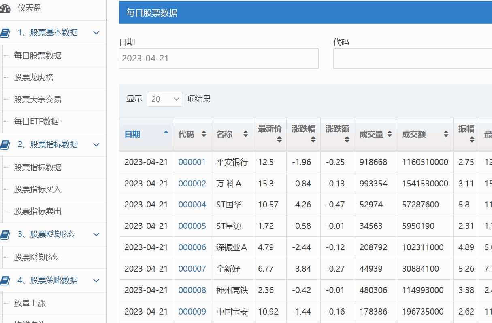
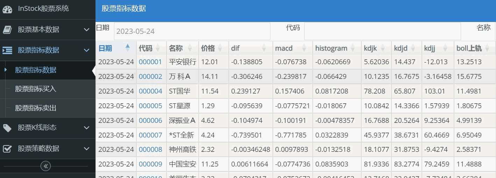
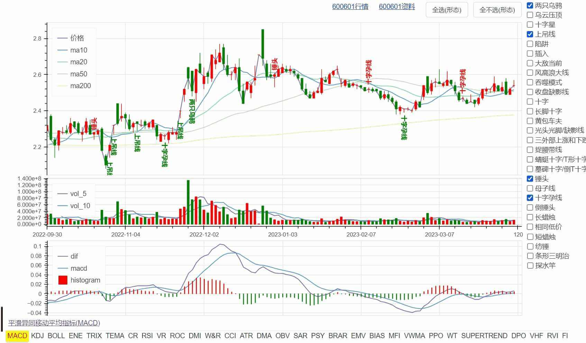
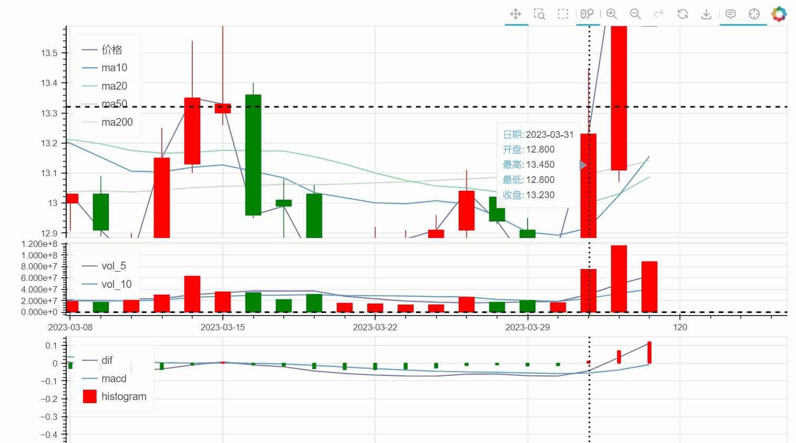
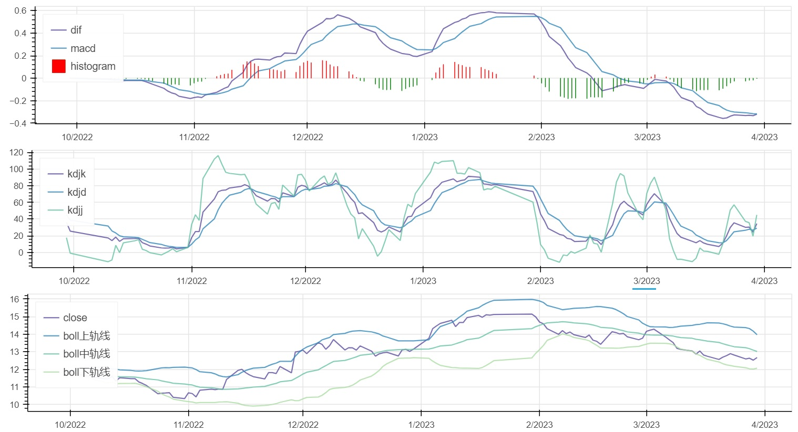
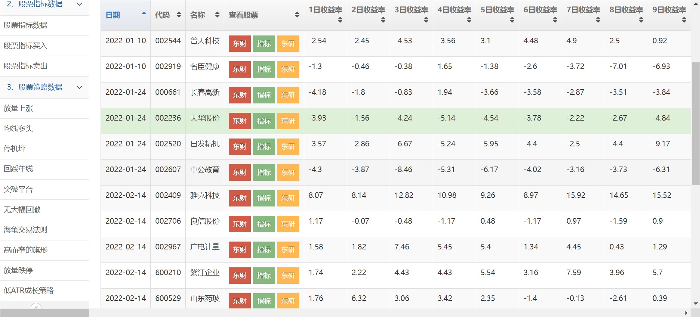
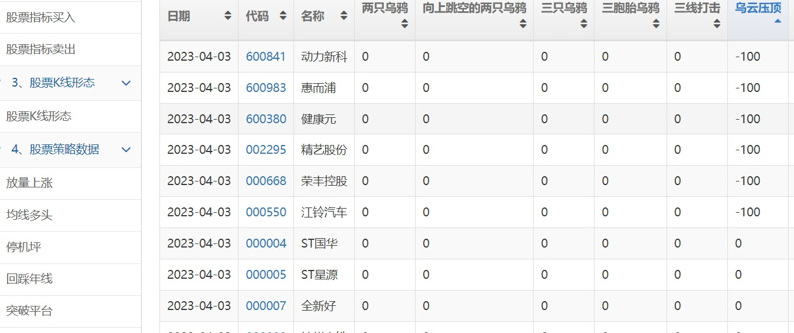
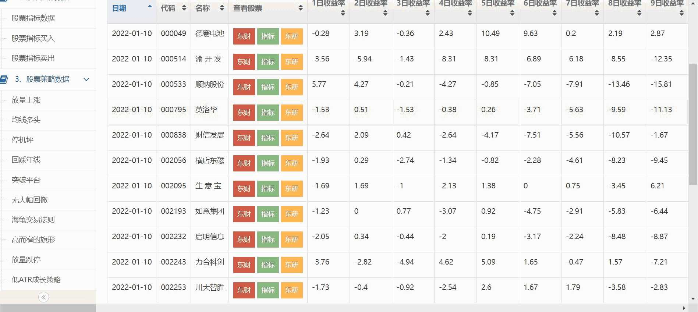
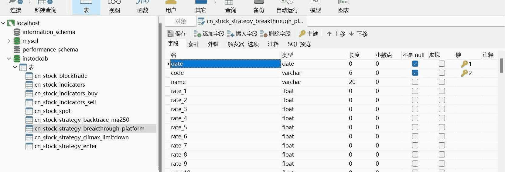
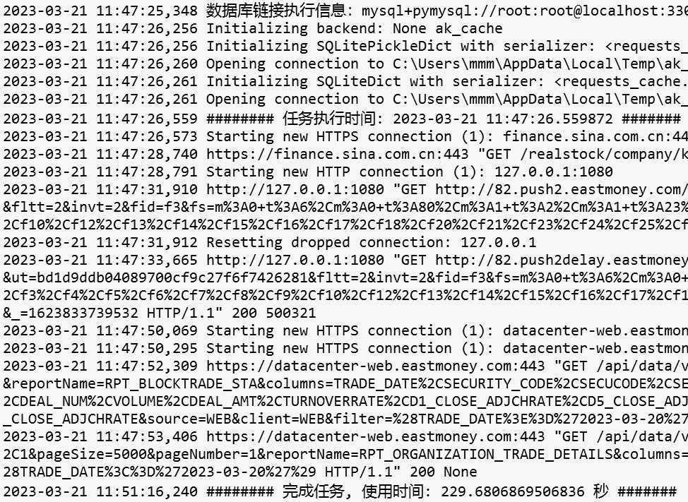

**InStock股票系统**

InStock股票系统，抓取股票每日关键数据，计算股票各种指标，识别K线各种形态，内置多种选股策略，支持选股验证回测，支持自动交易，支持批量时间，运行高效，是量化投资的好帮手。

# 功能介绍

##  一：股票每日数据
抓取A股票每日数据，主要为一些关键数据，同时封装抓取方法，方便扩展系统获取个人关注的数据。基于免费开源的akshare抓取，更多数据获取参见 [akshare官网文档](https://www.akshare.xyz/data/stock/stock.html)。



## 二：股票指标计算
基于talib、pandas 计算指标，计算高效准确。调整个别指标公式，确保结果和同花顺、通信达结果一致。
指标：

```
1、MACD 2、KDJ 3、BOLL 4、TRIX，TRMA 5、CR 6、SMA 7、RSI 
8、VR，MAVR 9、ROC 10、DMI，+DI，-DI，DX，ADX，ADXR 11、W&R 
12、CCI 13、TR、ATR 14、DMA、AMA 15、OBV 16、SAR 17、PSY 
18、BRAR 19、EMV 20、BIAS 21、TEMA  22、MFI 23、VWMA
24、PPO 25、WT 26、Supertrend  27、DPO  28、VHF  29、RVI
30、FI 31、ENE 32、STOCHRSI
```






## 三：判断买入卖出的股票

根据指标判定可能买入卖出的股票，具体筛选条件如下：


```
KDJ:
1、超买区：K值在80以上，D值在70以上，J值大于90时为超买。一般情况下，股价有可能下跌。投资者应谨慎行事，局外人不应再追涨，局内人应适时卖出。
2、超卖区：K值在20以下，D值在30以下为超卖区。一般情况下，股价有可能上涨，反弹的可能性增大。局内人不应轻易抛出股票，局外人可寻机入场。
RSI:
1、当六日指标上升到达80时，表示股市已有超买现象，如果一旦继续上升，超过90以上时，则表示已到严重超买的警戒区，股价已形成头部，极可能在短期内反转回转。
2、当六日强弱指标下降至20时，表示股市有超卖现象，如果一旦继续下降至10以下时则表示已到严重超卖区域，股价极可能有止跌回升的机会。
CCI:
1、当CCI＞﹢100时，表明股价已经进入非常态区间——超买区间，股价的异动现象应多加关注。
2、当CCI＜﹣100时，表明股价已经进入另一个非常态区间——超卖区间，投资者可以逢低吸纳股票。
CR:
1、跌穿a、b、c、d四条线，再由低点向上爬升160时，为短线获利的一个良机，应适当卖出股票。
2、CR跌至40以下时，是建仓良机。
WR:
1、当％R线达到20时，市场处于超买状况，走势可能即将见顶。
2、当％R线达到80时，市场处于超卖状况，股价走势随时可能见底。
VR:
1、获利区域160－450根据情况获利了结。
2、低价区域40－70可以买进。
```



## 四：K线形态识别

精准识别61种K线形态，支持用户自选形态识别。

识别形态:

```
1、两只乌鸦2、三只乌鸦3、三内部上涨和下跌4、三线打击5、三外部上涨和下跌6、南方三星7、三个白兵8、弃婴
9、大敌当前10、捉腰带线11、脱离12、收盘缺影线13、藏婴吞没14、反击线15、乌云压顶16、十字17、十字星
18、蜻蜓十字/T形十字19、吞噬模式20、十字暮星  21、暮星22、向上/下跳空并列阳线23、墓碑十字/倒T十字
24、锤头25、上吊线26、母子线27、十字孕线28、风高浪大线29、陷阱30、修正陷阱31、家鸽32、三胞胎乌鸦
33、颈内线34、倒锤头35、反冲形态36、由较长缺影线决定的反冲形态37、梯底38、长脚十字39、长蜡烛
40、光头光脚/缺影线 41、相同低价42、铺垫43、十字晨星44、晨星45、颈上线46、刺透形态47、黄包车夫
48、上升/下降三法49、分离线50、射击之星51、短蜡烛52、纺锤53、停顿形态54、条形三明治55、探水竿
56、跳空并列阴阳线57、插入58、三星59、奇特三河床60、向上跳空的两只乌鸦61、上升/下降跳空三法 
```
形态识别结果：
```
负：出现卖出信号
0：没有出现该形态
正：出现买入信号
```



## 五：策略选股

内置放量上涨、停机坪、回踩年线、突破平台、放量跌停等多种选股策略，同时封装了策略模板，方便扩展实现自己的策略。


```
1、放量上涨
2、均线多头
3、停机坪
4、回踩年线
5、突破平台
6、无大幅回撤
7、海龟交易法则
8、高而窄的旗形
9、放量跌停
10、低ATR成长
```



## 六：选股验证


对指标、策略等选出的股票进行回测，验证策略的成功率，是否可用。


## 七：自动交易

支持自动交易，内置自动打新股的策略，由于**涉及金钱**，可能存在风险，所以没有提供其他交易策略，请自己写。

## 八：支持批量


可以通过时间段、枚举时间、当前时间进行指标计算、策略选股及回测等。同时支持智能识别交易日，可以输入任意日期。

具体执行设置如下：
```
------整体作业，支持批量作业------
当前时间作业 python execute_daily_job.py
单个时间作业 python execute_daily_job.py 2022-03-01
枚举时间作业 python execute_daily_job.py 2022-01-01,2021-02-08,2022-03-12
区间时间作业 python execute_daily_job.py 2022-01-01 2022-03-01

------单功能作业，支持批量作业，回测数据自动填补到当前
基础数据作业 python basic_data_daily_job.py
指标数据作业 python indicators_data_daily_job.py
K线形态作业 klinepattern_data_daily_job.py
策略数据作业 python strategy_data_daily_job.py
回测数据 python backtest_data_daily_job.py
```

## 九：存储采用数据库设计

数据存储采用数据库设计，能保存历史数据，以及对数据进行扩展分析、统计、挖掘。系统实现自动创建数据库、数据表，封装了批量更新、插入数据，方便业务扩展。



## 十：展示采用web设计

采用web设计，可视化展示结果。对展示进行封装，添加新的业务表单，只需要配置视图字典就可自动出现业务可视化界面，方便业务功能扩展。

## 十一：运行高效


采用多线程、单例共享资源有效提高运算效率。1天数据的抓取、计算指标、形态识别、策略选股、回测等全部任务运行时间大概4分钟（普通笔记本），计算天数越多效率越高。


## 十二：方便调试

系统运行的重要日志记录在stock_execute_job.log(数据抓取、处理、分析)、stock_web.log(web服务)，方便调试发现问题。




# 安装说明

建议windows下安装，方便操作及使用系统，同时安装也非常简单。以下安装及运行以windows为例进行介绍。

1.安装最新的 python

```
（1）在官网 https://www.python.org/downloads/ 下载安装包，一键安装即可，安装切记勾选自动设置环境变量。
（2）配置永久全局国内镜像库（因为有墙，无法正常安装库文件），执行如下dos命令：
python pip config --global set  global.index-url https://mirrors.aliyun.com/pypi/simple/
# 如果你只想为当前用户设置，你也可以去掉下面的"--global"选项
```
2.安装最新的 mysql

```
在官网 https://dev.mysql.com/downloads/mysql/ 下载安装包，一键安装即可。
```
3.安装库文件，库都是目前最新版本

a.安装依赖库：

```
#dos切换到本系统的根目录，执行下面命令：
python pip install -r requirements.txt
```
b.若想升级项目依赖库至最新版，可以通过下面方法：
```
python pip install --upgrade -r requirements.txt 
```

c.若扩展了本项目，可以通过下面方法生成项目依赖：

```
#使用pipreqs生成项目相关依赖的requirements.txt

python pip install pipreqs
# 安装pipreqs，若有安装可跳过

python pipreqs --encoding utf-8 ./ 
# 本项目是utf-8编码
```

4.安装 talib

```
第一种方法. pip 下安装
（1）https://www.ta-lib.org/下载并解压ta-lib-0.4.0-msvc.zip
（2）解压并将ta_lib放在C盘根目录
（3）https://visualstudio.microsoft.com/zh-hans/downloads/下载并安装Visual Studio Community，安装切记勾选Visual C++功能
（4）Build TA-Lib Library # 构建 TA-Lib 库
    ①在开始菜单中搜索并打开[Native Tools Command Prompt](根据操作系统选择32位或64位)
    ②输入 cd C:\ta-lib\c\make\cdr\win32\msvc
    ③构建库，输入 nmake
（5）安装完成。
第二种方法. Anaconda 下安装
（1）打开Anaconda Prompt终端。
（2）在终端输入命令行conda install -c conda-forge ta-lib 。
（3）此处确认是否继续安装？输入y 继续安装，直到完成
（4）安装完成。
```
5.安装 Navicat（可选）

Navicat可以方便管理数据库，以及可以手工对数据进行查看、处理、分析、挖掘。

Navicat是一套可创建多个连接的数据库管理工具，用以方便管理 MySQL、Oracle、PostgreSQL、SQLite、SQL Server、MariaDB 和 MongoDB 等不同类型的数据库

```
（1）在官网 https://www.navicat.com.cn/download/navicat-premium 下载安装包，一键安装即可。

（2）然后下载破解补丁: https://pan.baidu.com/s/18XpTHrm9OiLEl3u6z_uxnw 提取码: 8888 ，破解即可。
```
6.配置数据库

一般可能会修改的信息是”数据库访问密码“。

修改database.py相关信息:

```
db_host = "localhost"  # 数据库服务主机
db_user = "root"  # 数据库访问用户
db_password = "root"  # 数据库访问密码
db_port = 3306  # 数据库服务端口
db_charset = "utf8mb4"  # 数据库字符集
```

# 运行说明

1.执行数据抓取、处理、分析

支持批量作业，具体参见run_job.bat中的注释说明。

建议将其加入到任务计划中，工作日的每天17：00执行。

```

运行 run_job.bat
```
2.启动web服务

```
运行 run_web.bat
```
3.启动交易服务

```
运行 run_trade.bat
```


# 特别声明

本系统参考了shidenggui、pythonstock、sngyai。

股市有风险投资需谨慎，本系统只能用于学习、股票分析，投资盈亏概不负责。
