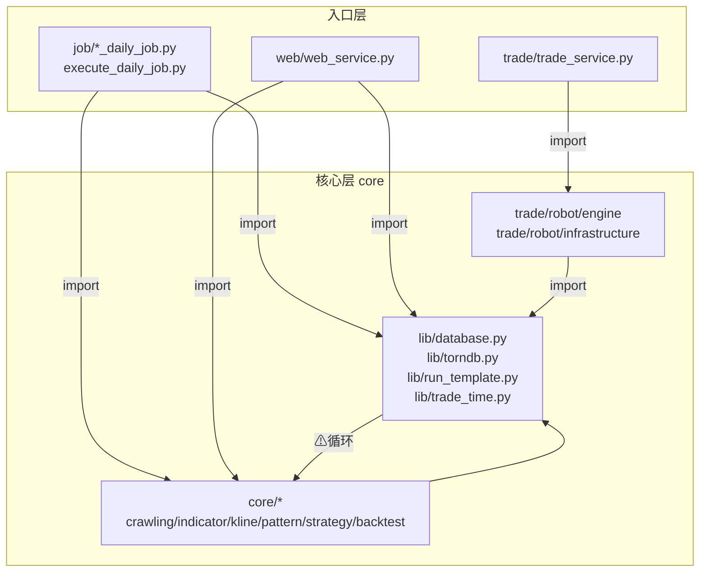

# ARCHITECTURE.md

InStock 分层架构。每条论断标注 `file:line`。

## 层级图

## 层级表

| 包 | 职责 | fan-in / fan-out | 入口点 |
|---|---|---|---|
| `instock/job` | 日作业编排与批跑 | fan-out: →lib(72), →core(39) | `execute_daily_job.py:35` main、9 个 `*_daily_job.py` 的 main |
| `instock/web` | Tornado Web 展示与关注 | fan-out: →core(9), →lib | `web_service.py:71` main，端口 9988 |
| `instock/trade` | 实盘交易引擎 | fan-out: →lib(12) | `trade_service.py:19` main |
| `instock/core` | 抓取/指标/形态/策略/回测 | fan-in: job+web；fan-out: →lib(18) | `stockfetch.py`、`eastmoney_fetcher.py` |
| `instock/lib` | DB、torndb、批跑模板、交易时间 | fan-out: →core(6 ⚠循环)；fan-in: 高 | `database.py`、`run_template.py` |
| `instock/trade/robot` | MainEngine/ClockEngine/EventEngine | fan-out: →lib | `main_engine.py:22` MainEngine |

边界调用统计（import 边数）：job→lib(72), job→core(39), core→lib(18), trade→lib(12), web→core(9), lib→core(6 ⚠循环), core→trade(0 imports)。

## 热点函数（按 fan_in 排序）

| fan_in | 函数 | 位置 |
|---|---|---|
| 31 | `eastmoney_fetcher.make_request` | `instock/core/eastmoney_fetcher.py:86` |
| 22 | `torndb.Connection.get` | `instock/lib/torndb.py:157` |
| 19 | `database.checkTableIsExist` | `instock/lib/database.py:158` |
| 18 | `database.executeSql` | `instock/lib/database.py:172` |
| 18 | `database.insert_db_from_df` | `instock/lib/database.py:69` |
| 18 | `tablestructure.get_field_types` | `instock/core/tablestructure.py:1064` |
| 15 | `ClockEngine.now` | `instock/trade/robot/engine/clock_engine.py:154` |
| 12 | `singleton_proxy.get_proxies` | `instock/core/singleton_proxy.py:30` |

`make_request` 是所有东方财富抓取的统一出口，被 `instock/core/crawling/stock_hist_em.py` 等多模块调用（`instock/core/crawling/stock_hist_em.py:44` 等）。

## 已知问题

- **lib→core 循环**：`instock/lib/trade_time.py:5` `from instock.core.singleton_trade_date import stock_trade_date`，lib 层依赖 core 层；既有结构，harness 不修，linter 标记。`trade_time` 又被 `instock/trade/robot/engine/clock_engine.py:10` 与 `instock/lib/run_template.py:10` 引用。
- **execute_daily_job 部分 job 被注释**：`instock/job/execute_daily_job.py:49-56` 中指标、K线形态、策略、回测作业被注释，默认仅跑基础数据 + 选股 + 收盘数据。
- **DB 默认弱口令**：`instock/lib/database.py:14-18` 默认 root/root，依赖环境变量覆盖。

## 入口点清单

- Web：`instock/web/web_service.py:71` `main()`，监听 9988（`web_service.py:76-77`）。
- 交易：`instock/trade/trade_service.py:19` `main()`，构造 `MainEngine(broker='gf_client', ...)`（`trade_service.py:20-25`）。
- 全量作业：`instock/job/execute_daily_job.py:35` `main()`，调度链见 `execute_daily_job.py:40-59`。
- 9 个 job mains：`init_job.py:52`、`basic_data_daily_job.py:71`、`basic_data_other_daily_job.py`、`basic_data_after_close_daily_job.py`、`indicators_data_daily_job.py:156`、`klinepattern_data_daily_job.py`、`strategy_data_daily_job.py`、`backtest_data_daily_job.py`、`selection_data_daily_job.py:46`，统一由 `execute_daily_job.py` 调度或经 `run_template.run_with_args` 批跑。
